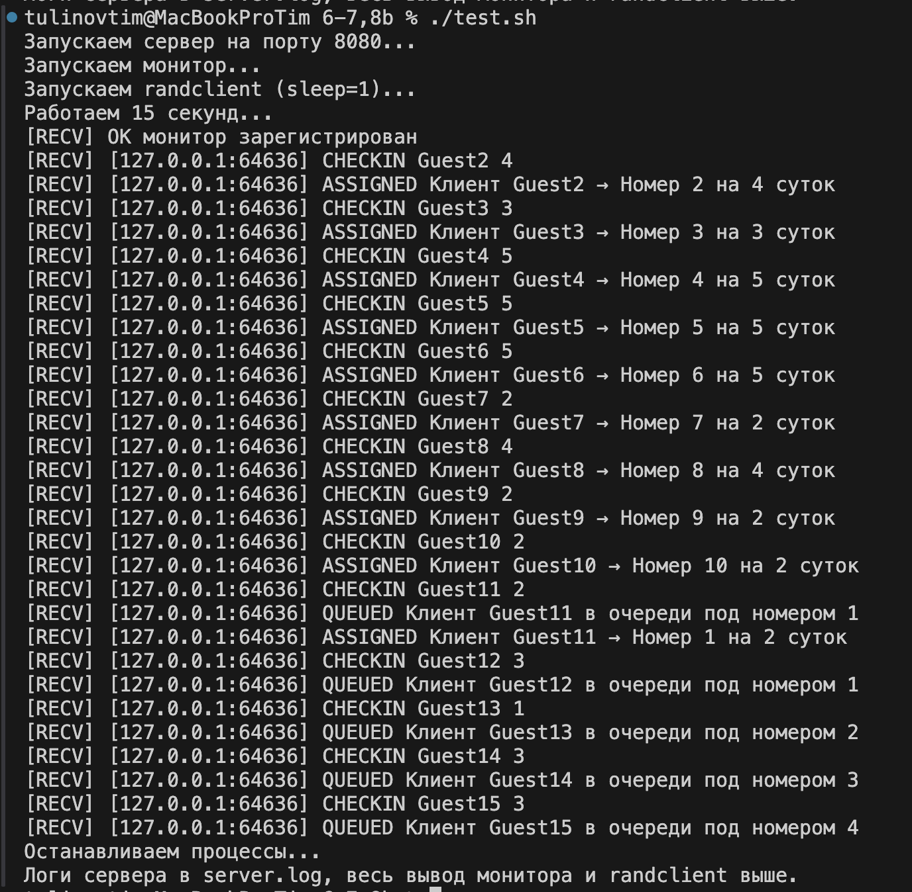

## 1. Исполнитель

Тулинов Тимофей Антонович, группа БПИ236

## 2. Условие задачи

**Вариант 16**
 Задача о социалистической гостинице. В гостинице 10 одноместных номеров. Клиенты гостиницы снимают номер на одни или несколько суток (задаётся при создании клиента). Если в гостинице нет свободных номеров, клиенты не уходят, а устраиваются на рядом с гостиницей на скамейках и ждут в порядке очереди, пока любой из номеров не освободится (других гостиниц в городе нет).

Создать клиент–серверное приложение, моделирующее работу гостиницы.

Сервер — это гостиница. Прибывающие гости могут порождаться отдельным общим клиентом. 

 Клиенты подключаются к серверу и отправляют команду

```
CHECKIN <имя> <дни>
```

где `<имя>` — уникальное имя гостя, `<дни>` — срок проживания (1–5). Если свободные комнаты есть, сервер возвращает

```
ASSIGNED Клиент <имя> → Номер <N> на <дни> суток
```

иначе клиент помещается в очередь и получает

```
QUEUED Клиент <имя> в очереди под номером <позиция>
```

Помимо клиентов, к серверу могут подключаться мониторы командой

```
MONITOR
```

— и получают в реальном времени все события заселения/освобождения комнат.

## 3. Архитектура и процессы

1. **Сервер (`server`)**

   * Запускается как

     ```bash
     ./server <port>
     ```
   * Создаёт слушающий TCP-сокет на порту `<port>`, настраивает `SIGINT/SIGTERM`-обработчики и функции `atexit`.
   * Хранит в глобальной области:

     * `hotel[MAX_ROOMS]` — массив структур `guest` (имя + оставшиеся дни).
     * `free_counter` — счётчик свободных комнат.
     * Односвязную очередь (`queue_node *q_head, *q_tail`) для ожидающих гостей.
     * Массив `monitor_socks[]` для сокетов мониторов.
   * Использует три мьютекса:

     * `mtx_rooms` — защита массива комнат и `free_counter`.
     * `mtx_queue` — защита очереди.
     * `mtx_monitors` — защита списка мониторов.
   * Порождает:

     * Поток **clock\_thread**, который каждые `DAY_TIME` секунд уменьшает `cur_days`, освобождает комнаты и раздаёт их из очереди.
     * Для каждого клиента поток **handle\_client**, обрабатывающий команды `CHECKIN`, `QUEUE`, `MONITOR`.

2. **Клиент (`randclient`)**

   * Запускается как

     ```bash
     ./randclient <server_ip> <port> <sleep_time>
     ```
   * Подключается к серверу, генерирует каждые `<sleep_time>` секунд гостя `Guest<N>` со случайным сроком (1–5), отправляет `CHECKIN` и выводит ответ.

3. **Монитор (`monitor`)**

   * Запускается как

     ```bash
     ./monitor <server_ip> <port>
     ```
   * Подключается, шлёт `MONITOR\n`, в фоновом потоке читает и печатает все сообщения от сервера.

4. **Тестовый скрипт (`test.sh`)**

   * Компилирует `server`, `randclient`, `monitor`.
   * Очищает порт 8080, запускает сервер, монитор и `randclient` (sleep=1).
   * Ждёт 15 секунд, затем завершает все и сохраняет логи.

## 4. Описание программы

 Поток `clock_thread` моделирует «сутки» (каждые 6 сек), освобождает комнаты и расселяет из очереди. Клиентские потоки обрабатывают `CHECKIN` (заселение/очередь), `QUEUE` (список ожидания) и `MONITOR` (регистрация монитора). Все события ретранслируются мониторам. Обработчики `SIGINT/SIGTERM` и `atexit`-функции обеспечивают корректное завершение (закрытие сокетов, очистка очереди, вывод финального сообщения).

## 5. Формат командной строки

* **Сервер:**

  ```bash
  ./server <port>
  ```
* **Клиент:**

  ```bash
  ./randclient <server_ip> <port> <sleep_time>
  ```
* **Монитор:**

  ```bash
  ./monitor <server_ip> <port>
  ```
* **Тестовый скрипт:**

  ```bash
  ./test.sh
  ```

  ## 6. Тесты

